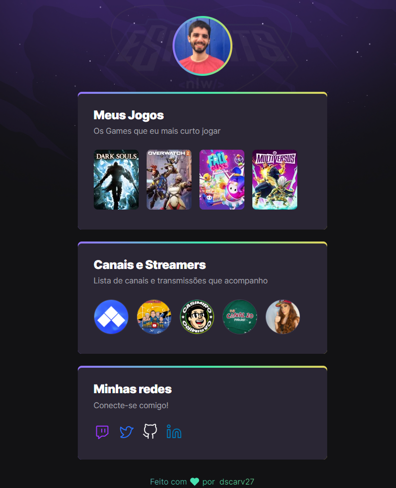

# nlw-esports

> trilha explorer

projeto construido durante o evento Next Level Week da Rocketseat.

[Clique aqui para acessar](https://dscarv27.github.io/nlw-esports/)

> tecnologias

- HTML
- CSS
- Git e GitHub

> o que praticamos

- HTML: 
Header, Body e Footer;
Seções, Listas e Tags; 
Acessibilidade;

-CSS:
- Import de fontes, Reset de página, Hover, Linear-gradient, Key-frames, :nth-child e Responsividade